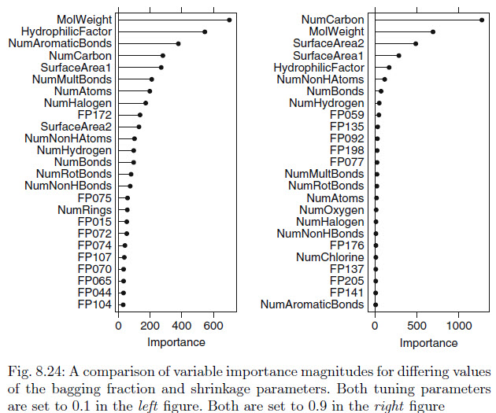

```{r setup, include=FALSE}
knitr::opts_chunk$set(echo = TRUE)
library(caret)
library(kableExtra)
library(tidyverse)
```

# Assignment
Do problems 8.1, 8.2, 8.3, and 8.7 in Kuhn and Johnson.  Please submit the Rpubs link along with the .rmd file.

## 8.1. Recreate the simulated data from Exercise 7.2:
```{r}
library(mlbench)
set.seed(200)
simulated <- mlbench.friedman1(200, sd = 1)
simulated <- cbind(simulated$x, simulated$y)
simulated <- as.data.frame(simulated)
colnames(simulated)[ncol(simulated)] <- "y"
```
### (a) 
Fit a random forest model to all of the predictors, then estimate the
variable importance scores:
```{r}
library(randomForest)
library(caret)
model1 <- randomForest(y ~ ., data = simulated,
  importance = TRUE,
  ntree = 1000)

(rfImp1 <- varImp(model1, scale = FALSE))
```
Did the random forest model significantly use the uninformative predictors
(V6 – V10)?

* We can see the model prefered using V1, V2, V4, & V5
* The numbers significantly dropoff at v6 

### (b) 
Now add an additional predictor that is highly correlated with one of the
informative predictors. For example:
```{r}
set.seed(42)
simulated$duplicate1 <- simulated$V1 + rnorm(200) * .1
cor(simulated$duplicate1, simulated$V1)
```

```{r}
model2 <- randomForest(y ~.,data = simulated, importance = TRUE, ntree = 1000)
(rfImp2 <- varImp(model2, scale = FALSE))
```
  
Fit another random forest model to these data. Did the importance score
for V1 change? What happens when you add another predictor that is
also highly correlated with V1?
  
* The Score did change
  * V1 significantly dropped from 8.68 to 5.72
  
### (c) 
Use the cforest function in the party package to fit a random forest model
using conditional inference trees. The party package function varimp can
calculate predictor importance. The conditional argument of that function
toggles between the traditional importance measure and the modified
version described in Strobl et al. (2007). Do these importances show the
same pattern as the traditional random forest model?

#### Unconditional Model
```{r}
library(party)
set.seed(42)
model3 <- cforest(y ~ ., data=simulated)

(rfImp3.1 <-varimp(model3))
```
  
#### Conditional Model

```{r}
(rfImp3.2 <-varimp(model3, conditional = TRUE))
```

* V1 dropped between the Unconditional vs Conditional model
* Neither model improved or made significant V6-V10
* The Duplicate value also dropped due to being tied to V1.

### (d) 
Repeat this process with different tree models, such as boosted trees and
Cubist. Does the same pattern occur?

```{r}
library(Cubist)
model4 <- cubist(x=simulated[,-(ncol(simulated)-1)], y=simulated$y, committees=100)
as.data.frame(as.matrix(varImp(model4)))
```

* The general pattern holds with the cubist model; V1-V5 are the significant
  * V3 and V1 seem to have flipped

```{r}
library(gbm)

model5 <- gbm(y ~ ., data = simulated, distribution='gaussian')
summary(model5)
```

* No real change in the pattern of V1-V5 being top significance.
* V7-V10 are now 0 value

```{r}
library(ipred)
model6 <- bagging(y ~ ., data=simulated, nbagg = 50)
varImp(model6)
```

* The Bagging classification method allowed V10 to have high significance
* V6-V9 are still lower than V1-V5

## 8.2. 
Use a simulation to show tree bias with different granularities.

```{r}
library(rpart)

set.seed(42)
X1 <- rep(1:2, each=100)
X2 <- rnorm(200, mean = 0, sd = 2)
Y <- X1 + rnorm(200, mean = 0, sd = 4)
sim <- data.frame(Y = Y, X1 = X1, X2 = X2)

model7 <- rpart(Y~., data = sim)

as.data.frame(as.matrix(varImp(model6)))
```


## 8.3. 



In stochastic gradient boosting the bagging fraction and learning rate
will govern the construction of the trees as they are guided by the gradient.
Although the optimal values of these parameters should be obtained
through the tuning process, it is helpful to understand how the magnitudes
of these parameters affect magnitudes of variable importance. Figure 8.24
provides the variable importance plots for boosting using two extreme values
for the bagging fraction (0.1 and 0.9) and the learning rate (0.1 and 0.9) for
the solubility data. The left-hand plot has both parameters set to 0.1, and
the right-hand plot has both set to 0.9:

### (a) 
Why does the model on the right focus its importance on just the first few
of predictors, whereas the model on the left spreads importance across
more predictors?

* Stochastic gradiant boosts the bagging fraction and learning rate.
* Model on Right had more time to learn so focused on important predictors
* Model on the left is more spread across the predictors because of using more bagging fractions and uses more data in model construction.

### (b) 
Which model do you think would be more predictive of other samples?

* Left due to the smaller learning rate and bagging fraction being more robust.

### (c) 
How would increasing interaction depth affect the slope of predictor importance
for either model in Fig. 8.24?

* The Slope would be more steep due to the interaction depth spreading out the importance of the predictors.  
* As the tree depth increases it causes a more uniform spread of variable importance across all variables; making the importance lines bigger and more steep. 

## 8.7 
Refer to Exercises 6.3 and 7.5 which describe a chemical manufacturing
process. Use the same data imputation, data splitting, and pre-processing
steps as before and train several tree-based models:

### (a) 
Which tree-based regression model gives the optimal resampling and test
set performance?

```{r}
library(AppliedPredictiveModeling)
data("ChemicalManufacturingProcess")
set.seed(42)

predictors <- subset(ChemicalManufacturingProcess, select=-Yield)
yield <- subset(ChemicalManufacturingProcess, select="Yield")

traindata <- createDataPartition(yield$Yield, p = .80, list = FALSE)

x_train <- predictors[traindata,]
y_train <- yield[traindata,]

x_test <- predictors[-traindata,]
y_test <- yield[-traindata,]  

nearzero_pred <- nearZeroVar(x_train)
train_predictors <- x_train[-nearzero_pred]
test_predictors <- x_test[-nearzero_pred]

#pp <- preProcess(trans_x_train, method = c("BoxCox","center","scale","knnImpute"))
#trans_x_train <- predict(pp, trans_x_train)
#trans_x_test <- predict(pp, trans_x_test)


train_yield <- yield[traindata,]
test_yield <- yield[-traindata,]

tune_param <- trainControl(method = "boot", number = 25)
```


#### Regression Tree with classification
```{r}
rtgrid <- expand.grid(maxdepth=seq(1,10,by=1))
rtmodel <- train(x=train_predictors, y = train_yield, method = "rpart2",
                   metric = "Rsquared", tuneGrid = rtgrid, trControl = tune_param)

rtpred <- predict(rtmodel, test_predictors)
postResample(pred = rtpred, obs = test_yield)
```
  
#### Cubist  
```{r}
cubegrid <- expand.grid(committees = c(1,5,10,20,50,100),neighbors = c(0,1,3,5,7))

cubemodel <- train(x=train_predictors, y = train_yield, method = "cubist",
                   metric = "Rsquared", tuneGrid = cubegrid, trControl = tune_param)

cubepred <- predict(cubemodel, test_predictors)
postResample(pred = cubepred, obs = test_yield)
```

#### GBM
```{r}
gbmgrid <- expand.grid(interaction.depth=seq(1,6,by=1),n.trees=c(25,50,100,200),shrinkage=c(0.01,0.05,0.1,0.2),n.minobsinnode=c(5, 10, 15))

gbmmodel <- train(x=train_predictors, y = train_yield, method = "gbm",
                   metric = "Rsquared", tuneGrid = gbmgrid, trControl = tune_param, verbose = FALSE)

gbmpred <- predict(gbmmodel, test_predictors)
postResample(pred = gbmpred, obs = test_yield)
```

* If we were basing the entire performance on R2, the model I would chose is GBM
* I would choose Cubist due to the lower error stats and nearly identicial R2 as GBM

### (b) 
Which predictors are most important in the optimal tree-based regression
model? Do either the biological or process variables dominate the list?
How do the top 10 important predictors compare to the top 10 predictors
from the optimal linear and nonlinear models?

```{r}
cubist_imp <- varImp(cubemodel, scale = FALSE)
plot(cubist_imp, top=20, scales = list(y=list(cex=0.8)))
```

Manufacturing Processes dominate the top predictors, again
* MP32 is the top predictor in botrh model styles
* MP9 and 17 are also in the top 5 of both styles

### (c) 
Plot the optimal single tree with the distribution of yield in the terminal
nodes. Does this view of the data provide additional knowledge about the
biological or process predictors and their relationship with yield?

```{r}
library(partykit)

plot(as.party(rtmodel$finalModel))
```

* It doesn't help me at this time, I'm sure it will in the future.  
